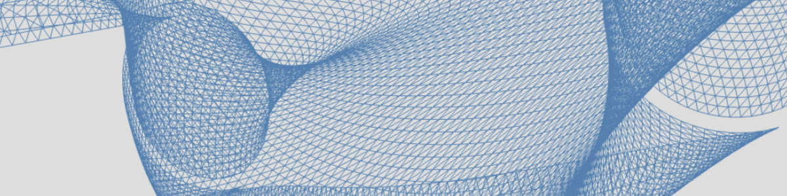
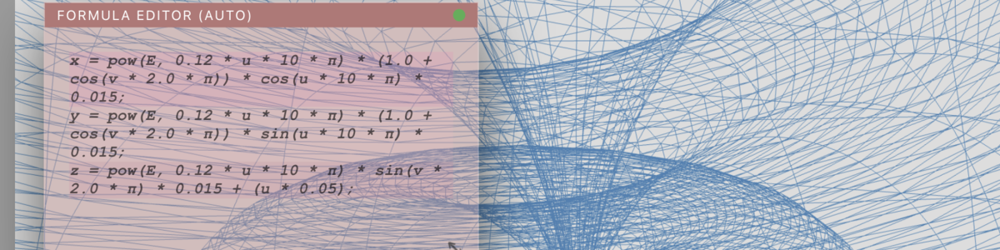
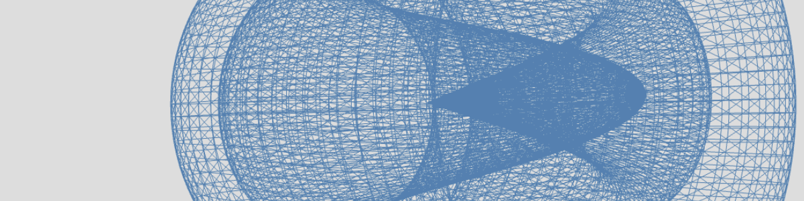
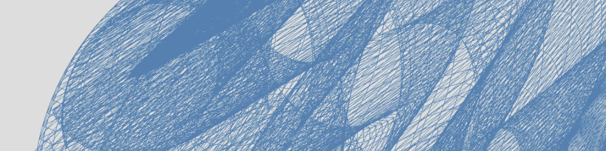

# Parametric 3D Engine  <!-- omit in toc -->

A browser-based environment for exploring complex mathematical surfaces and parametric geometry. Refactored and rearchitected in 2026 with the assistance of LLMs.

**[https://jaseknighter.github.io/parametric](https://jaseknighter.github.io/parametric)** 

[](https://jaseknighter.github.io/parametric)
[](https://github.com/jaseknighter/parametric)

---

## Table of Contents <!-- omit in toc -->

- [Current Status](#current-status)
- [📊 Quality Dashboards](#-quality-dashboards)
- [Documentation](#documentation)
  - [Background](#background)
  - [Release Manifest v0.5: The Unified Engine Baseline](#release-manifest-v05-the-unified-engine-baseline)
  - [DRAFT Technical Documentation (LLM Generated)](#draft-technical-documentation-llm-generated)
- [Post-v0.5 Priorities: Transparency \& Test Depth](#post-v05-priorities-transparency--test-depth)
- [Reporting Issues \& Feature Requests](#reporting-issues--feature-requests)
- [Installation for Local Development](#installation-for-local-development)
- [Credits](#credits)

### Current Status
**v0.5 rearchitecture release live (20260119)** 
The engine has transitioned to a multi-threaded, JIT-compiled model. Coverage: >80%.
CI logic and coverage validated via Chromium (V8). Full cross-browser parity (WebKit/Firefox) verified in local development tier.

<details>
<summary><strong>Test Coverage & Pass Rates</strong></summary>

<!-- START_COVERAGE_DASHBOARD -->
| Category | Metric | Result | Environment |
| :--- | :--- | :--- | :--- |
| **Services Layer** | Statement Coverage | N/A | Jest / Node v20 |
| **Security Layer** | Statement Coverage | N/A | Jest / Node v20 |
| **Logic Layer** | Statement Coverage | N/A | Jest / Node v20 |
| **Web Worker** | Branch Coverage | N/A | Jest / Node v20 |
| **Display Layer** | Statement Coverage | N/A | Playwright |
| **Smoke Suite** | Pass Rate (Chrome) | ✅ 100% (115/115) | Playwright |
| **Smoke Suite** | Pass Rate (Firefox) | ✅ 100% (115/115) | Playwright |
| **Smoke Suite** | Pass Rate (WebKit) | ✅ 100% (115/115) | Playwright |

*Generated by `npm run test:full-baseline` on 1/24/2026, 9:35:50 AM PST*

### 📊 Quality Dashboards
* [**Unified Coverage Report (Jest + Playwright)**](https://jaseknighter.github.io/parametric/monocart-report/index.html)
* [**Playwright Test Trace**](https://jaseknighter.github.io/parametric/playwright-report/index.html)


<!-- END_COVERAGE_DASHBOARD -->

</details>

---

### Documentation



1. **Explore:** Interact with the shape.  
   - Click or move to rotate the geometry.  
   - Swipe or pinch to zoom (device-dependent).
2. **Shape:** Select a *shape* from the sidebar to load its preset parameters.
3. **Project:** Use the buttons in the *project* sidebar to change the ordering of dimensions.
4. **Morph:** Adjust variables like $resolution$, $bending$, or $scale$ oscillations using the sliders.
5. **Edit:** Modify the underlying GLSL-style formulas in real time using the **HUD (Heads-Up Display)**.
6. **Animate:** Automatically toggle the animation loop if a formula contains a $t$ variable to visualize temporal changes.
7. **Export:** Generate an .STL file for use in a 3D viewer, printer, or modeler.

---



#### Background 

When I was a kid I got a computer. It had a single 5.25" floppy drive and a monochrome monitor that displayed green text on a black background. I played lots of Zork on it ("go west...you bump into a wall...go west...you bump into a wall...") Not too long after, I received a graphics card for the computer that came with a manual explaining how to program simple shapes and display them up on the monitor. That magical experience of seeing how a computer can take a few lines of code and turn them into an image has never left me. 

This project was started in 2019 as part of an effort to learn React.js and return to my coding roots after spending many, many years not coding as an IT Manager. I believe what drew me to this project had something to do with a desire to revisit that early experience working with code to create images, in a (relatively) straightforward manner.

The specific form this project took, an exploration of parametric forms, was directly inspired by the formulas and ideas presented in the book <a href="https://www.amazon.com/Morphing-Mathematical-Transformations-Architects-Designers/dp/1780674139">Morphing: A Guide to Mathematical Transformations for Architects and Designers (Laurence King Publishing, 2015)</a> by Joseph Choma.

Not too long after completing the initial Parametric Geometry Explorer code, I encountered the world of [monome](https://monome.org/), their grid and norns sound computer, as well as the [lines](https://llllllll.co/) forum, populated by an amazingly kind and curious group of coders and musicians lovingly established as a way to better engage around monome's amazing works of art and many other topics. 

My own engagement with the monome devices, fueled by their focus on simplicity of form, completely open approach to freely crafting code in a community setting for other people, led me to learn Lua and SuperCollider, and author a number of scripts for norns. Most notably, I authored [flora](https://github.com/jaseknighter/flora), a [Lindenmayer systems](https://en.wikipedia.org/wiki/L-system) sequencer and bandpass-filtered sawtooth engine. 

The Parametric Geometry Explorer project and my work with the monome devices and lines community both connect directly to that formative playful experience I had as a kid, encountering simple graphical forms on a screen, generated from not that many lines of code.

My purpose in revisiting my 2019 Parametric Geometry Explorer started as a simple attempt to use an LLM to help me get it working again after sitting dormant on my laptop for many years. Soon after starting, I found myself in the middle of an unplanned experiment: changes grew rapidly, and I was forced to evolve the code into something more robust and well-architected just to get it working—through deep engagement and cooperation with LLMs.

As the code developed, I purposefully did not investigate any "best practices" for how to work with LLMs to write code. I really wanted to see what I could create by simply jumping into dialog and watching things grow and break and grow some more.

Technically speaking, the Parametric Geometry Explorer serves as an interactive bridge between pure mathematics and real-time 3D visualization. The 2026 v0.5 rewrite represents a fundamental shift in how the application processes complex topological data, moving from a single-threaded bottleneck to a high-performance worker-based system.

I hope you enjoy exploring the application as much as I have enjoyed building it.

---

#### Release Manifest v0.5: The Unified Engine Baseline

The v0.5 release represents a core transplant to enable modern performance and mathematical fidelity.

**1. The Architectural Shift: Main Thread to Worker**
* **Asynchronous Geometry Pipeline:** Calculations moved from blocking the main thread to a Request-Response model to prevent UI freezing.
* **Zero-Copy Memory Transfer:** 3D datasets now use `ArrayBuffer` transfers to minimize latency by transferring ownership rather than cloning data.
* **Worker Watchdog:** A 2-second "Hang Monitor" and 50ms throttle gate ensure UI responsiveness during formula spikes.

**2. The JIT Formula Engine (Math Authority)**
* **Dynamic Execution:** Hardcoded shapes are replaced by a live `Function` constructor, enabling HUD text to generate real-time 3D instructions.
* **Mathematical Safety:** `safeDiv` and `safeTan` wrappers handle malformed state packets by falling back to identity ($0$) instead of crashing.

**3. Reliability & Testing**
* **Unified Coverage:** Jest and Playwright reports are merged into a single diagnostic view.
* **80% Threshold:** Statement coverage greater than 80% is required for this baseline release.

**4. Continuity & Interaction**
* **Preserved UX:** Sliders and navigation remain consistent with previous versions while feeling more responsive.
* **Schema Compatibility:** JSON configuration files remain fully backward-compatible with existing shape definitions.

---



#### Lessons Learned <!-- omit in toc -->

**Draft:** under review

---

#### Guidelines for Working with LLMs <!-- omit in toc -->
* Triangulating for Truthiness: Effective Engagement with LLMs for Software Engineering (**Draft:** under review)

---

#### DRAFT Technical Documentation (LLM Generated)

The following sections are under active development and subject to change.

* **Architecture**
   * [Architecture](./docs/drafts/ARCHITECTURE.md)
   * [Manifest v0.5](./docs/drafts/MANIFESTS/MANIFEST_VERSION_0.5.md)
   * [Parametric Authority (v0.5 Baseline)](./docs/drafts/PARAMETRIC_AUTHORITY.md)
* **Design Patterns**
   * [Design Patterns: Core vs. Supporting Invariants](./docs/drafts/DESIGN_PATTERNS.md)
* **Implementation**
   * [Implementation Notes](./docs/drafts/IMPLEMENTATION_NOTES.md)
   * [Formula Authority State Machine](./docs/drafts/FORMULA_AUTHORITY_STATE_MACHINE.md)
   * [Observability](./docs/drafts/OBSERVABILITY.md)
* **Reference**
   * [Glossary](./docs/drafts/GLOSSARY.md)

---

### Post-v0.5 Priorities: Transparency & Test Depth
1. **Accessibility (System Universalization):** Ensure the HUD and Sidebar states are announced correctly for screen readers, allowing the engine's mathematical state to be understood non-visually.
2. **Performance:** Determine maximum vertex ceilings per device and monitor garbage collection pressure during animations.
3. **Observability:** Implement a "Black Box" flight recorder to capture math failures in the wild.
4. **Fidelity:** Shift from "existence" testing to "accuracy" testing via predicate-based numerical validation.

---

### Reporting Issues & Feature Requests

* **Bug Reports:** Please include steps to replicate the issue and a copy of the console log (enabled by adding `?debug=true` to the URL).
* **Feature Requests:** Open an issue to discuss new parametric presets or UI enhancements.

Note: the roadmap is pretty well set for the near future and I have not yet begun to think about how I want this experiment to evolve over time.

---

### Installation for Local Development

To set up the environment and the new Worker-based architecture locally:

1. **Clone the repo:**
   ```bash
   git clone https://github.com/jaseknighter/parametric.git
   cd parametric
   ```

2. **Install dependencies:**

    `npm install`

3. **Start the development server:**

    `npm run dev`

---

### Credits
* **Mathematical Foundation**: Inspired by the formulas and ideas in the book <a href="https://www.amazon.com/Morphing-Mathematical-Transformations-Architects-Designers/dp/1780674139">Morphing: A Guide to Mathematical Transformations for Architects and Designers (Laurence King Publishing, 2015)</a> by Joseph Choma.
* **AI Collaboration**: Architectural refinement, "Exorcism" of legacy 2019 logic, and testing pipelines developed through deep engagement with Large Language Models.