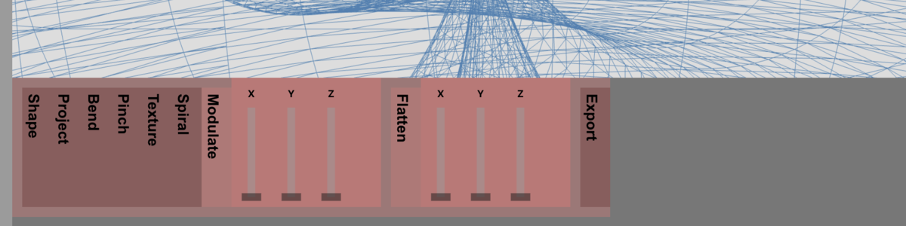

# Parametric 3D Engine <!-- omit in toc -->

A browser-based environment for exploring complex mathematical surfaces and parametric geometry. Refactored and rearchitected in 2026 with the assistance of LLMs.

**[https://jaseknighter.github.io/parametric](https://jaseknighter.github.io/parametric)** 

[](https://jaseknighter.github.io/parametric)
[](https://github.com/jaseknighter/parametric)

---

## Table of Contents <!-- omit in toc -->

- [Current Status](#current-status)
  - [Test Coverage \& Pass Rates](#test-coverage--pass-rates)
  - [📊 Quality Dashboards](#-quality-dashboards)
  - [Meta-Testing Report (Experimental Quality Signals - POC)](#meta-testing-report-experimental-quality-signals---poc)
    - [Heuristic Definitions](#heuristic-definitions)
    - [How to read this report](#how-to-read-this-report)
  - [Quality Pipeline Self-Validation](#quality-pipeline-self-validation)
- [Documentation](#documentation)
  - [Formula Editor: Manual Override](#formula-editor-manual-override)
  - [Math Reference](#math-reference)
  - [Interface Reference](#interface-reference)
  - [Additional Features \& Formulas](#additional-features--formulas)
    - [1. Move Multiple Sliders at Once](#1-move-multiple-sliders-at-once)
    - [2. Animation](#2-animation)
    - [Additional Formulas](#additional-formulas)
  - [Background](#background)
  - [Recent Releases](#recent-releases)
    - [Release Manifest v0.5: The Unified Engine Baseline](#release-manifest-v05-the-unified-engine-baseline)
  - [Technical Documentation (DRAFT - LLM Generated)](#technical-documentation-draft---llm-generated)
- [Post-v0.5 Priorities: Transparency \& Test Depth](#post-v05-priorities-transparency--test-depth)
- [Reporting Issues \& Feature Requests](#reporting-issues--feature-requests)
- [Development and Testing](#development-and-testing)
  - [Installation](#installation)
  - [Testing Commands](#testing-commands)
  - [Feature Flags (v0.5.0.1)](#feature-flags-v0501)
- [Credits](#credits)

## Current Status
**v0.5.4.1 maintenance release live (20260130)** 
The engine has transitioned to a multi-threaded, JIT-compiled model. Coverage: >80%.
CI logic and coverage validated via Chromium (V8). Full cross-browser parity (WebKit/Firefox) verified in local development tier.

### Test Coverage & Pass Rates
 
<!-- START_COVERAGE_DASHBOARD -->
| Category | Metric | Result | Environment |
| :--- | :--- | :--- | :--- |
| **Services Layer** | Statement Coverage | ✅ 85% (101/119) | Jest / Node v20 |
| **Security Layer** | Statement Coverage | ✅ 94% (15/16) | Jest / Node v20 |
| **Logic Layer** | Statement Coverage | ✅ 83% (50/60) | Jest / Node v20 |
| **Web Worker** | Branch Coverage | ✅ 86% (60/70) | Jest / Node v20 |
| **Display Layer** | Statement Coverage | ⚠️ 73.73% (421/571) | Playwright |
| **Smoke Suite** | Pass Rate (Chrome) | ✅ 100% (155/155) | Playwright |
| **Smoke Suite** | Pass Rate (Firefox) | N/A | Playwright |
| **Smoke Suite** | Pass Rate (WebKit) | N/A | Playwright |

*Generated by `npm run test:full-baseline` on 1/31/2026, 7:58:36 AM PST*

### 📊 Quality Dashboards
* [**Unified Coverage Report (Jest + Playwright)**](https://jaseknighter.github.io/parametric/monocart-report/)
* [**Playwright Test Trace**](https://jaseknighter.github.io/parametric/playwright-report/)


<!-- END_COVERAGE_DASHBOARD -->

<!-- START_META_REPORT -->
### Meta-Testing Report (Experimental Quality Signals - POC)

> A "Meta-testing" POC project was introduced in v0.5.4 as a **diagnostic experiment** (not a gate).
> Results are informational and are not used to fail CI at this time.

This project evaluates quality at three distinct levels:

*   **Level 1 — Tests**
    Do features behave correctly?
*   **Level 2 — Meta-Tests**
    Do tests express the *right intent* and assert meaningful behavior?
*   **Level 3 — Quality Pipeline Self-Validation** 
    Does the auditing system itself work and remain trustworthy?

Only Level 1 tests affect CI pass/fail. Levels 2 and 3 are observability layers.

#### Heuristic Definitions
| Tag | Interpreted Intent | Required Markers (Regex) |
| :--- | :--- | :--- |
| **`[behavior]`** | User-facing interaction | `fireEvent`, `userEvent`, `click`, `postMessage` |
| **`[policy]`** | Architectural invariant | `toThrow`, `ReadOnly`, `frozen`, `Boundary` |
| **`[failure-mode]`** | Error handling | `error`, `NaN`, `Infinity`, `invalid` |

#### How to read this report
Meta-testing does not measure whether tests pass. It measures whether tests clearly express their intent.

*   🟢 **Strong** — intent declared, behavior exercised, assertion meaningful
*   🟡 **Weak** — intent declared, but assertion only checks existence
*   🔴 **Mismatch** — intent tag present, but implementation doesn’t validate it

Untagged tests are not considered failures. They represent areas not yet evaluated by this experimental system.

*Last Audit: 2026-01-31*

| Metric | Result |
| :--- | :--- |
| **Total Tests (Static)** | 301 (+7 Dynamic Templates) |
| **Tagged** | 22 |
| **Intent Alignment** | 🚨 18 Mismatches |
| **Strong Assertion Ratio** | ⚠️ 3 Weak |
| **Intent Visibility Gaps** | 279 <br> *(tests not yet semantically classified)* |
| **Coverage** | N/A |


### Quality Pipeline Self-Validation
*These tests ensure that:*
*   The audit can detect tagged and untagged tests
*   Metrics are retrievable and stable
*   Changes to the audit logic cannot silently invalidate reports

These serve as self-validation for the quality pipeline.

| Self-Validation Metric | Result |
| :--- | :--- |
| **Test Run** | 3 |
| **Pass** | 3 |
| **Fail** | 0 |
| **High-Value Areas Covered** | GeometryBuilder, Worker |

<!-- END_META_REPORT -->

---

## Documentation


<!-- START_UI_REFERENCE -->
### Formula Editor: Manual Override

> **Use formulas to directly control the 3D shape.**

Provides a live view of GLSL expressions. Edits here override the interface presets. Any formulas you write manually will be erased if you update the interface controls.

### Math Reference

The following math functions and constants are supported in the Formula Editor:

`sin`, `cos`, `tan`, `atan2`, `abs`, `sqrt`, `pow`, `exp`, `log`, `min`, `max`, `sign`, `floor`, `ceil`, `round`, `PI` (or `π`), `E`.

---



### Interface Reference

| Interface Element | What does it do? | How does it work? |
| :--- | :--- | :--- |
| **Shape:** Base Topology | Choose the starting form for your 3D model. | Selects the starting vertex distribution (e.g., Sphere, Klein Bottle, Romanesco Broccoli Floret). Initial state is a circle morphed by temporal oscillation. |
| **Project:** Vector Mapping | Select which internal values control the X, Y, and Z axes. Changing these rotates the shape. Deselecting an axis flattens the shape to 2D. | Determines which internal calculation (x, y, or z) drives the physical X, Y, and Z coordinates. |
| **Bend:** Curvature & Arching | Curve the shape along its main axes. | theta = (v - 0.5) * amt * scalar; x' = dist * cos(theta) |
| **Pinch:** Vertex Concentration | Pull points together or spread them along an axis. | v' = sgn(v) * \|v\|^(1.0 + (amt * scalar)) * n |
| **Texture:** Surface Displacement | Add fine bumps and waves to the surface. | 1.0 + (sin(u) * cos(v) * outerAmt) + (sin(u) * sin(v) * innerAmt) |
| **Spiral:** Coordinate Torsion | Twist the shape around its center. | theta' = atan2(B, A) + (amt * r * scalar) |
| **Modulate:** Surface Oscillation | Overlay gentle ripples or waves on the shape. | Delta = sin(u * freq) * cos(v * freq) * amt |
| **Flatten:** Linear Compression | Compress the shape along one direction. | v' = v * (1.0 - amt) |
| **Export:** Geometry Output | Save your model for use in other software. | STL produces 3D manifold files. SVG (v0.5.4) projects the 3D view into a 2D vector path for plotting. |

<!-- END_UI_REFERENCE -->

### Additional Features & Formulas

#### 1. Move Multiple Sliders at Once
Holding **Shift** while dragging any interface slider reduces the parameter's movement sensitivity by a factor of 10. This is used for fine-tuning high-frequency textures or minor rotational adjustments.

#### 2. Animation
The engine supports the `t` variable (elapsed time in seconds). This is used to drive periodic movement or surface oscillations.

**Simple Animation Example:** 
*Copy and paste this into the Formula Editor (HUD) to replace the existing logic:*
```glsl
// A simple oscillating sphere
x = cos(u * 2 * PI) * sin(v * PI) * (1.0 + sin(t) * 0.2);
y = sin(u * 2 * PI) * sin(v * PI) * (1.0 + sin(t) * 0.2);
z = cos(v * PI) * (1.0 + sin(t) * 0.2);
```
---
#### Additional Formulas 

**Formula A**

```text
x = cos(u * 2*π) * sin(v * 4*π)
y = sin(u * 2*π) * sin(v * π)
z = cos(v * π)
```

* Generates a **parametric 3D surface** based on spherical coordinates.
* The `u` parameter wraps around the horizontal axis (azimuth), and `v` wraps vertically (polar).
* Produces a smooth **rippling or “flower-like” pattern** along the surface due to the `sin(v * 4π)` in `x`.
* Essentially a **warped sphere** with repeating vertical folds.

**Formula B** 

```text
x = (sign(cos(u * 2 * π) * sin(v * π) + (1 + u * 0.2556) * cos(u * 0.2556 * (π * 12)) * 0.3) * pow(abs(cos(u * 2 * π) * sin(v * π) + (1 + u * 0.2556) * cos(u * 0.2556 * (π * 12)) * 0.3), 3.0000));
y = sin(u * 2 * π) * sin(v * π) + (1 + u * 0.2556) * cos(u * 0.2556 * (π * 12)) * 0.3;
z = cos(v * π) + (1 + u * 0.2556) * sin(u * 0.2556 * (π * 12)) * 0.3;
```

* Builds on a base spherical surface like Formula A.
* Adds **complex modulation and twisting**, including higher-frequency oscillations (`cos(u * 0.2556 * 12π)` and `sin(u * 0.2556 * 12π)`).
* The `sign` and `pow(..., 3)` in `x` **amplify or flatten regions**, creating sharp peaks and valleys.
* Result is a **highly sculpted 3D shape** with folds, spikes, and distortions.

**Formula C**

```text
let pulse = sin(t * 0.5) * 1.6;
x = cos(u * 2*π) * sin(v * π) + cos(v * pulse * 12*π) * 0.6
y = sin(u * 2*π * pulse) * sin(v * π)
z = cos(v * π)
```

* Introduces **temporal animation** using the `pulse` variable (`t` is time).
* The `pulse` modulates the horizontal rotation (`u`) and adds a **dynamic rippling effect** in `x`.
* Produces a **breathing, twisting 3D surface** that continuously evolves.
* Essentially a **living, animated variant of Formula A**, where the shape “pulses” over time.


---


### Background 

When I was a kid I got a computer. It had a single 5.25" floppy drive and a monochrome monitor that displayed green text on a black background. I played lots of Zork on it ("go west...you bump into a wall...go west...you bump into a wall...") Not too long after, I received a graphics card for the computer that came with a manual explaining how to program simple shapes and display them up on the monitor. That magical experience of seeing how a computer can take a few lines of code and turn them into an image has never left me. 

This project was started in 2019 as part of an effort to learn React.js and return to my coding roots after spending many, many years not coding as an IT Manager. I believe what drew me to this project had something to do with a desire to revisit that early experience working with code to create images, in a (relatively) straightforward manner.

The specific form this project took, an exploration of parametric forms, was directly inspired by the formulas and ideas presented in the book <a href="https://www.amazon.com/Morphing-Mathematical-Transformations-Architects-Designers/dp/1780674139">Morphing: A Guide to Mathematical Transformations for Architects and Designers (Laurence King Publishing, 2015)</a> by Joseph Choma.

Not too long after completing the initial Parametric Geometry Explorer code, I encountered the world of [monome](https://monome.org/), their grid and norns sound computer, as well as the [lines](https://llllllll.co/) forum, populated by an amazingly kind and curious group of coders and musicians lovingly established as a way to better engage around monome's amazing works of art and many other topics. 

My own engagement with the monome devices, fueled by their focus on simplicity of form, completely open approach to freely crafting code in a community setting for other people, led me to learn Lua and SuperCollider, and author a number of scripts for norns. Most notably, I authored [flora](https://github.com/jaseknighter/flora), a [Lindenmayer systems](https://en.wikipedia.org/wiki/L-system) sequencer and bandpass-filtered sawtooth engine. 

The Parametric Geometry Explorer project and my work with the monome devices and lines community both connect directly to that formative playful experience I had as a kid, encountering simple graphical forms on a screen, generated from not that many lines of code.

My purpose in revisiting my 2019 Parametric Geometry Explorer started as a simple attempt to use an LLM to help me get it working again after sitting dormant on my laptop for many years. Soon after starting, I found myself in the middle of an unplanned experiment: changes grew rapidly, and I was forced to evolve the code into something more robust and well-architected just to get it working—through deep engagement and cooperation with LLMs.

As the code developed, I purposefully did not investigate any "best practices" for how to work with LLMs to write code. I really wanted to see what I could create by simply jumping into dialog and watching things grow and break and grow some more.

Technically speaking, the Parametric Geometry Explorer serves as an interactive bridge between pure mathematics and real-time 3D visualization. The 2026 v0.5 rewrite represents a fundamental shift in how the application processes complex topological data, moving from a single-threaded bottleneck to a high-performance worker-based system.

I hope you enjoy exploring the application as much as I have enjoyed building it.

---

### Recent Releases

* **[v0.5.4.1](https://github.com/jaseknighter/parametric/releases/tag/v0.5.4.1)** (2026-01-30): Mobile UX hardening. Fixed iPhone container alignment, optimized tooltip persistence, and established Social Math serialization requirements. Flipped feature flags for prior 0.5.X optimizations to enable them by default.
* **[v0.5.4](https://github.com/jaseknighter/parametric/releases/tag/v0.5.4)** (2026-01-29): Meta-Testing PoC. Introduced semantic intent auditing and SVG vector export pipeline.
* **[v0.5.3](https://github.com/jaseknighter/parametric/releases/tag/v0.5.3)** (2026-01-28): Display Domain Optimization. Mobile ergonomics, bottom-docked HUD, and unified coverage integration.
* **[v0.5.2](https://github.com/jaseknighter/parametric/releases/tag/v0.5.2)** (2026-01-28): Guidance Bridge. Integrated the instructional registry with adaptive tooltips and documentation syncing.
* **[v0.5.1](https://github.com/jaseknighter/parametric/releases/tag/v0.5.1)** (2026-01-27): The Accessible Cockpit. Semantic parallelism, ARIA landmarks, and keyboard navigation for 3D space.
* **[v0.5.0](https://github.com/jaseknighter/parametric/releases/tag/v0.5.0)** (2026-01-24): The Unified Engine Baseline. Core transplant to multi-threaded worker architecture and JIT formula compilation.

#### Release Manifest v0.5: The Unified Engine Baseline

The v0.5 release represents a core transplant to enable modern performance and mathematical fidelity.

**1. The Architectural Shift: Main Thread to Worker**
* **Asynchronous Geometry Pipeline:** Calculations moved from blocking the main thread to a Request-Response model to prevent UI freezing.
* **Zero-Copy Memory Transfer:** 3D datasets now use `ArrayBuffer` transfers to minimize latency by transferring ownership rather than cloning data.
* **Worker Watchdog:** A 2-second "Hang Monitor" and 50ms throttle gate ensure UI responsiveness during formula spikes.

**2. The JIT Formula Engine (Math Authority)**
* **Dynamic Execution:** Hardcoded shapes are replaced by a live `Function` constructor, enabling HUD text to generate real-time 3D instructions.
* **Mathematical Safety:** `safeDiv` and `safeTan` wrappers handle malformed state packets by falling back to identity ($0$) instead of crashing.

**3. Reliability & Testing**
* **Unified Coverage:** Jest and Playwright reports are merged into a single diagnostic view.
* **80% Threshold:** Statement coverage greater than 80% is required for this baseline release.

**4. Continuity & Interaction**
* **Preserved UX:** Sliders and navigation remain consistent with previous versions while feeling more responsive.
* **Schema Compatibility:** JSON configuration files remain fully backward-compatible with existing shape definitions.

---


### Lessons Learned <!-- omit in toc -->

**Draft:** under review

---

### Guidelines for Working with LLMs <!-- omit in toc -->
* Triangulating for Truthiness: Effective Engagement with LLMs for Software Engineering (**Draft:** under review)

---

### Technical Documentation (DRAFT - LLM Generated)

The following sections are under active development and subject to change.

* **Architecture**
   * [Architecture](./docs/drafts/ARCHITECTURE.md)
   * [Manifest v0.5](./docs/drafts/MANIFESTS/MANIFEST_VERSION_0.5.md)
   * [Parametric Authority (v0.5 Baseline)](./docs/drafts/PARAMETRIC_AUTHORITY.md)
   * [Accessibility Hardening (v0.5.1 Spec)](./docs/drafts/ACCESSIBILITY.md)
   * [Guidance Bridge (v0.5.2 Spec)](./docs/drafts/GUIDANCE_BRIDGE.md)
* **Design Patterns**
   * [Design Patterns: Core vs. Supporting Invariants](./docs/drafts/DESIGN_PATTERNS.md)
* **Implementation**
   * [Implementation Notes](./docs/drafts/IMPLEMENTATION_NOTES.md)
   * [Formula Authority State Machine](./docs/drafts/FORMULA_AUTHORITY_STATE_MACHINE.md)
   * [Observability](./docs/drafts/OBSERVABILITY.md)
   * [Feature Flags (Lightweight Spec)](./docs/drafts/development/FEATURE_FLAGS_LIGHTWEIGHT.md)
   * [Feature Flags (Testing Strategy)](./docs/drafts/FEATURE_FLAGS_TESTING.md)
   * [Instructional Registry (v0.5.2)](./docs/drafts/USER_INSTRUCTIONS.md)
* **Testing**
   * [Meta-Testing Specs (v0.5.4)](./docs/drafts/METATESTING.md)
   * [Testing Tips-N-Tricks](./docs/drafts/TESTING-TIPS-N-TRICKS.md)
* **Reference**
   * [Glossary](./docs/drafts/GLOSSARY.md)
* **Future Concepts**
   * [Tooltip Math Visualizer](./docs/drafts/TOOLTIP_MATH_VISUALIZER.md)

---

## Post-v0.5 Priorities: Transparency & Test Depth
1. **Accessibility (System Universalization):** Ensure the HUD and Sidebar states are announced correctly for screen readers, allowing the engine's mathematical state to be understood non-visually. (Aria tagging completed with 0.5.1. Acceptance testing not completed.)
2. **Fidelity:** Shift from "existence" testing to "accuracy" testing via predicate-based numerical validation. (POC live with 0.5.4. Evaluation Underway.)
3. **State Serialization (Social Math):** Implement URL-based state persistence. By injecting interface parameters (rotation, zoom, HUD formulas) into the URL, users can bookmark specific geometric states, share designs via a single link, and contribute to a community gallery of mathematical forms.
4. **Observability:** Implement a "Black Box" flight recorder to capture math failures in the wild.
5. **Performance:** Determine maximum vertex ceilings per device and monitor garbage collection pressure during animations.
6. **Retrospective Issue Generation:** Scripted creation of resolved GitHub issues based on analysis of the repository's commit history to backfill the project board.

---

## Reporting Issues & Feature Requests

* **Bug Reports:** Please include steps to replicate the issue and a copy of the console log (enabled by adding `?debug=true` to the URL before going through the steps that result in the issue being reported).
* **Feature Requests:** Open an issue to discuss new parametric presets or UI enhancements.

Note: the roadmap is pretty well set for the near future and I have not yet begun to think about how I want this experiment to evolve over time.

---

## Development and Testing

---

### Installation

1. **Clone the repo:**
   ```bash
   git clone https://github.com/jaseknighter/parametric.git
   cd parametric
   ```

2. **Install dependencies:**

    `npm install`

3. **Start the development server:**

    `npm start`

### Testing Commands
Run the following commands to verify system integrity:

*   `npm test`: Runs all unit tests (Jest).
*   `npm run test:full-baseline:ci`: Runs the full E2E suite (Playwright).
*   `npm run test:audit`: Executes the Meta-Testing diagnostic scan.
*   `npm run test:complete`: Orchestrates the full CI pipeline, including unified coverage and meta-reports.

### Feature Flags (v0.5.0.1)
First implemented in v0.5.0.1, the application uses a lightweight, URL-based feature flag system.

*   **Enable a flag:** `?flag_on=featureName`
*   **Disable a flag:** `?flag_off=featureName`

To display the feature flag UI, add `?showFlags=true` to the URL.

For detailed specifications, see:
*   Feature Flags: Lightweight Spec
*   Feature Flags: (Testing Strategy)[./docs/drafts/FEATURE_FLAGS_TESTING.md]

---

## Credits
* **Mathematical Foundation**: Inspired by the formulas and ideas in the book <a href="https://www.amazon.com/Morphing-Mathematical-Transformations-Architects-Designers/dp/1780674139">Morphing: A Guide to Mathematical Transformations for Architects and Designers (Laurence King Publishing, 2015)</a> by Joseph Choma.
* **AI Collaboration**: Architectural refinement, "Exorcism" of legacy 2019 logic, and testing pipelines developed through deep engagement with Large Language Models.